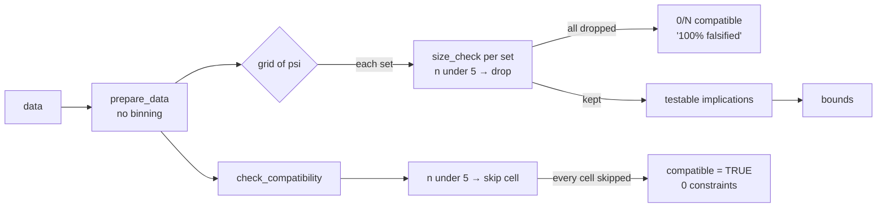
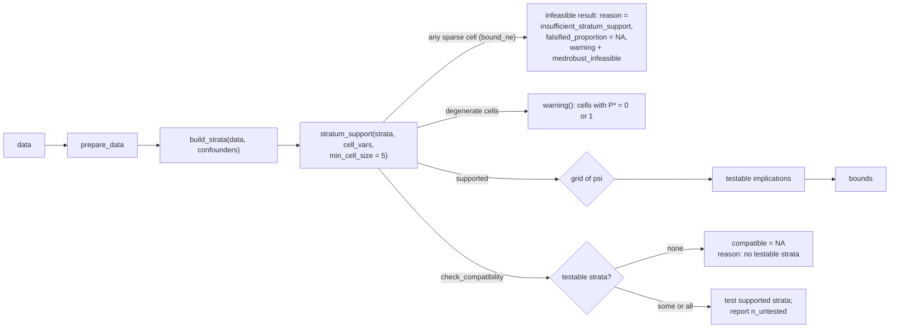

# BRAINSTORM: sparse strata and continuous confounders (#35)

**Date:** 2026-09-23 · **Depth:** deep · **Focus:** arch · **Issue:** [Data-Wise/medrobust#35](https://github.com/Data-Wise/medrobust/issues/35)
**Status:** decisions taken (6/6 below). **Decision 1 was revised after the adversarial review**: no `stop()`, keeping the FixA contract. The next step is a SPEC, after PR #38 merges.
**Code scanned:** `origin/dev` 7819731 (package code unchanged through 25df4b2).
**Reviewed:** 2026-09-23, adversarially, by opencode `big-pickle`. Every finding was re-verified; see [Review record](#review-record) and `REVIEW-sparse-strata-2026-09-23.md`.

---

## Problem in one paragraph

`bound_ne()` and `check_compatibility()` cross-classify `confounders` exactly, and `prepare_data()` does no binning. A continuous or high-cardinality confounder therefore makes nearly every row its own stratum. `bound_ne()` then drops every parameter set for n < 5 cells and reports the drops as **"100% falsified"**. `check_compatibility()` skips those cells and returns a vacuous **`compatible = TRUE`** after testing 0 constraints. Neither output says the data were never tested.

| Evidence (reproduced 2026-09-23) | Result |
|---|---|
| `heals_data`, confounders `age, male, smoking, bmi`, region R1\*, `n_grid = 10` | 450 strata for 450 rows; 0/100 compatible, `falsified_proportion = 1` |
| same data and region R1\*, `confounders = NULL` | 100/100 compatible |
| `simulate_dm_data(..., confounder_params = list(type = "binary"))`, mediator path, region R2, `n_grid = 10` | 2 strata; 100/100 compatible |
| same call, `type = "continuous"` | 8000 strata; **0/100**, `falsified_proportion = 1` |
| `check_compatibility(heals_data, ..., confounders = 4 vars)`, psi = (0.6, 0.9, 6, 0.136) | `compatible = TRUE`, `n_constraints_total = 0` |

- **R1\*** = `sn0` ∈ [0.55, 0.65], `sp0` ∈ [0.85, 0.95], `psi_sn` ∈ [1e8, 1e9], `psi_sp` ∈ [0.10, 0.20]. The huge `psi_sn` is deliberate: it pushes Sn₁ past the empty (A\*=0, M=1, Y=1) cell of #36. **With any realistic region, `heals_data` without confounders is also 0/100**, and the cause there is that cell, not sparsity. R1\* isolates the sparsity effect only.
- **R2** = the `?bound_ne` example region: `sn0`, `sp0` ∈ [0.80, 0.99]; `psi_sn`, `psi_sp` ∈ [0.8, 1.5].
- All rows used the default `grid_method = "lhs"`.

The package's own simulator can produce data its estimator cannot use.

## What the code scan settled (no question needed)

1. **The method is defined for discrete C.** `vignettes/articles/identification-math.qmd:48` writes the mediation formula as a sum, Σ_c P(C=c) Σ_m …. The package never states this assumption as a requirement.
2. **The maintainer already coarsens in data prep.** `inst/scripts/prepare_nhanes_pa.R:78` records "Binary confounders crossed into bound_ne strata (8 cells; feasibility-checked 2026-06-15)", with age ≥ 50, female, and BMI ≥ 30. `gesthtn` uses one binary `C1`.
3. **The sparse check is data-only.** It never reads a parameter (`bound_ne_exposure.R:86-96`, `bound_ne_mediator.R:83-86`), so every parameter set passes it or every set fails. Running it per set is why sparsity shows up as falsification. It is also why the failing `heals_data` call cost 93 s: default `grid_method = "lhs"`, `n_grid = 50`, 2,500 samples × 1,800 cell lookups, all doomed (measured `real 93.35`).
4. **The rule has seven copies, plus one path with no gate at all.** The copies agree on the threshold (5) but differ in granularity and response:

   | Site | Cell | Response to n < 5 |
   |---|---|---|
   | `R/bound_ne_exposure.R:86-96` | (m, y, c) | drop the parameter set (`return(NULL)`) |
   | `R/bound_ne_mediator.R:83-86` | (a, c) | `compatible <- FALSE; break` for the set |
   | `R/check_compatibility.R:471` (exposure) | (m, y, c) | record the cell as `NA` in `stratum_details`, then `next`; the cell adds no constraints |
   | `R/check_compatibility.R:245` (mediator) | (a, c) | record the stratum as `NA`, then `next` |
   | `R/bound_ci.R:147` (mediator CI primitive) | (a, c) | `return(NULL)` for the endpoint computation |
   | `R/bound_ci.R:11-56` `.effect_at_psi_exposure()` | (m, y, c) | **no gate.** Missing cells are replaced with 0 (`if (is.null(v) \|\| is.na(v)) 0 else v`), and cells with n from 1 to 4 feed the endpoint SEs |
   | `R/optimization.R:320` | (m, y, c) | drop the set (`return(NULL)`) inside `fast_check_exposure_compatibility()`. That function has **no callers** on `dev` and looks up `stratum_sizes$M` / `$Y` by literal name, so delete it rather than route it through the helper. |
   | `R/utilities_helpers.R:255-256` | marginal A\*×M×Y table | warning only, **and only when `verbose = TRUE`**. It **cannot see strata**. |

   The last row is why the `heals_data` run warned about "1 sparse cell" instead of 450 sparse strata. With `verbose = FALSE` it says nothing at all.
5. **`compatible = NA` needs two consumers fixed.** `R/s7-methods.R:339` does `if (x@compatible)`, which fails with "missing value where TRUE/FALSE needed". `test_multiple_hypotheses()` (`R/falsification_summary.R:510`) binds `compatible` into its result data frame, so any boolean use downstream inherits the `NA`. The property itself (`class_logical`, no validator) accepts `NA`.
6. **Nothing uses continuous simulated confounders.** No file in `R/`, `tests/`, or `vignettes/articles/*.qmd` passes `type = "continuous"`, and `power_analysis()` uses the binary default. A warning there breaks nothing.
7. **The package already has a "do not stop" contract for empty grids** (found in review). `tests/testthat/test-bound-ne-infeasible.R`, from commit `3a9ee46` (SPEC-bound-ne-robust-2026-06-14, FixA), says: "bound_ne() must then return a valid medrobust_bounds object with NA bounds, a machine-readable @reason, n_compatible == 0, and signal a 'medrobust_infeasible' condition -- it must NOT stop()". Its trigger is **sparse data**: every (A, C1) cell holds about 4 rows. The package's own tests therefore rely on the same conflation #35 is about.
   - `grid_method = "adaptive"` / `"auto"` already `stop()` on an empty coarse grid (`optimization.R:144-147`), which is an existing exception to FixA.

## Decisions

| # | Question | Decision |
|---|---|---|
| 1 | What `bound_ne()` does with sparse strata | **One upfront, data-only check. No `stop()`**, keeping the FixA contract. It returns the infeasible `medrobust_bounds` object with `reason = "insufficient_stratum_support"` and `falsified_proportion = NA` (not 1), emits a warning naming the sparse (cell, C) combinations with their n and a coarsening hint, and signals `medrobust_infeasible` carrying that reason. No parameter set is evaluated. *(Revised after review; the original choice was `stop()`, which would have broken `test-bound-ne-infeasible.R` and reversed FixA.)* |
| 2 | Code structure | **One shared helper that builds strata and checks support, with `min_cell_size = 5` exposed as an argument**, used by every path, including the unguarded exposure CI primitive. |
| 3 | `check_compatibility()` when nothing was testable | **`compatible = NA` with a reason** (e.g. `"no testable strata"`). |
| 4 | Scope of continuous-C support | **Guard plus docs.** State the discrete-C assumption in `?bound_ne` and the methodology article. `simulate_dm_data(type = "continuous")` warns that `bound_ne()` needs discrete confounders. |
| 5 | Degenerate cells (n ≥ 5 but P\* = 0 or 1) | **Warn and name the cells, but keep computing.** Sampling slack stays with #36. |
| 6 | Release | **Ships in 0.5.0 with a NEWS entry.** No `stop()` is introduced, so code that handles the infeasible object keeps working. The visible changes are the new `reason` value, `falsified_proportion = NA` instead of 1, the new warning, and `min_cell_size`. `test-bound-ne-infeasible.R` must expect the new reason, which is correct because its data are sparse, not incompatible. |

## Architecture

### Current



### Proposed



### Helper sketch (internal, not exported)

```r
# One stratum id per distinct confounder combination; NULL confounders give one stratum.
build_strata(data, confounders)
#> list(data = <data with stratum_id>, strata = <data.frame: stratum_id + confounder values>)

# Path-specific cell variables:
#   exposure misclassified: cells are (M, Y, C)
#   mediator misclassified: cells are (A, C)
stratum_support(strata, cell_vars, min_cell_size = 5)
#> data.frame(stratum_id, <cell_vars>, n, sparse = n < min_cell_size, degenerate)

# Builds the warning text (first k rows plus a count) and the infeasible reason;
# bound_ne() returns the FixA infeasible object with it
describe_stratum_support(support, confounders, min_cell_size)
```

Draft warning:

```
Warning in `bound_ne()`:
1800 of 1800 (M, Y, C) cells have fewer than 5 observations (min_cell_size = 5);
returning an infeasible result (reason: insufficient_stratum_support). No parameter
set was tested, so nothing was falsified.
bound_ne() cross-classifies `confounders` exactly, so each distinct combination
of age, male, smoking, bmi is its own stratum (450 strata for 450 rows).
Coarsen continuous confounders first, e.g. age >= 50, BMI >= 30
(as inst/scripts/prepare_nhanes_pa.R does), or pass fewer confounders.
```

## Behavior matrix

| Situation | `bound_ne()` | `bound_ci()` | `check_compatibility()` |
|---|---|---|---|
| All cells ≥ `min_cell_size` | unchanged | unchanged | unchanged |
| Some or all cells sparse | **infeasible object**, reason `insufficient_stratum_support`, `falsified_proportion = NA`, warning plus `medrobust_infeasible` (today: 0/N, "100% falsified") | short-circuits to NA CIs, as it does today for `n_compatible == 0` (`bound_ci.R:228-239`) | partial: test the supported strata, add `n_untested_strata` and a warning *(proposal; see open question 2)*. None testable: **`compatible = NA`**, reason `"no testable strata"` (today: vacuous `TRUE`) |
| Degenerate cells (P\* = 0 or 1, n ≥ min) | compute plus **warning** naming the cells | as `bound_ne` | compute plus the same warning |
| `simulate_dm_data(type = "continuous")` | n/a | n/a | n/a; the simulator itself **warns** |

`bound_ne()` needs *every* stratum, because the effects standardize over Σ_c P(C=c). `check_compatibility()` tests implications stratum by stratum, so a partial test still means something. That difference is why the two respond differently to partial sparsity.

---

## Quick Wins (< 30 min)

1. **Document the discrete-C assumption** in `?bound_ne` `@details` and `?check_compatibility`, citing the Σ_c form. This costs nothing and would have prevented the `heals_data` vignette region.
2. **Warn in `simulate_dm_data()` when `type = "continuous"`** and point to coarsening. It is a one-line guard and breaks nothing (finding 6).
3. **Make the `compatible` consumers NA-safe**: the print at `R/s7-methods.R:339` and `test_multiple_hypotheses()` (finding 5). Decision 3 depends on both.

## Medium Effort (1–2 hrs)

- [ ] Add `build_strata()` / `stratum_support()` / `describe_stratum_support()` in a new `R/strata.R`, and route the live sites through them.
  - Delete the per-set `size_check` in `bound_ne_exposure.R`, the `break` in `bound_ne_mediator.R`, and the uncalled `fast_check_exposure_compatibility()`.
  - Add the missing gate to `.effect_at_psi_exposure()`.
- [ ] Return the FixA infeasible object with `reason = "insufficient_stratum_support"` and `falsified_proportion = NA` from the upfront check, emit the warning, and signal `medrobust_infeasible` carrying the reason.
- [ ] Add `min_cell_size = 5` to `bound_ne()`, `bound_ci()`, and `check_compatibility()`, validated as a positive integer.
- [ ] Return `compatible = NA` with a reason from `check_compatibility()` when no stratum is testable, and add `n_untested_strata` for the partial case.
- [ ] Add the degenerate-cell warning, derived exactly for the exposure path (constraints 1 and 2). For the mediator path, see open question 1.
- [ ] Replace the marginal-table warning at `utilities_helpers.R:255` with the stratum-level check, or remove it. Today it is also silent under `verbose = FALSE`.
- [ ] Update `test-bound-ne-infeasible.R` to expect `insufficient_stratum_support` for its sparse data, and add a **genuine-incompatibility** trigger that expects `infeasible_no_compatible_sets`.
  - The test header calls an empirical trigger "unreliable".
  - A hand-built exposure data set with an all-A\*=1 cell of adequate size is deterministic, as `tests/testthat/test-check-compatibility.R` in PR #38 shows.
- [ ] NEWS 0.5.0 entry, plus tests (see the test plan).

## Long-term (future sessions)

- [ ] **#36:** regenerate `heals_data` with the `nhanes_pa`-style binary confounders (age ≥ 50, BMI ≥ 30, …) and no zero cells. Check in `inst/scripts/prepare_heals_data.R`, and switch the vignette chunk to `eval: true`.
- [ ] **Sampling slack in the falsification step** (the #36 methods question). Today one sampled zero rejects the true psi about 14% of the time in `heals_data`'s cell.
- [ ] **Model-based standardization for continuous C** (parametric P(A\* | M, Y, C)). This needs a separate SPEC and an identification argument; it was out of scope by decision 4.
- [ ] Optional exported `coarsen_confounders()` if users keep hand-binning. It was not chosen now.
- [ ] **Resample-level sparsity in `bound_ci()`.** A bootstrap resample can go sparse even when the original data pass the check. The mediator CI primitive returns `NULL` there, and the exposure primitive computes from tiny cells. This interacts with #31, where failed resamples are not counted.

## Open questions (for the SPEC)

1. **Degenerate-cell rule on the mediator path.** On the exposure path, P\*(A\*=a | m, y, c) = 0 provably rejects every Sn or Sp < 1 (constraint 2 or 1). On the mediator path, a zero in P(Y, M\* | a, c) makes one solved term negative, but π_a = θ₁ + θ₀ can still land in [0, 1]. So the rejection is not automatic (the review confirmed this), and the warning condition needs deriving rather than copying.
2. **Partial sparsity in `check_compatibility()`:** test the supported strata and warn (proposed), or return the NA verdict? This was not asked. The proposal follows from the function's role as a point diagnostic.
3. **Warning size:** how many sparse rows to print before truncating (the `heals_data` case has 1,800).
4. **Bring `grid_method = "adaptive"` / `"auto"` under FixA?** They already `stop()` on an empty coarse grid (`optimization.R:144-147`). With the upfront support check, sparse data never reach them, but a genuinely incompatible region still stops there.

## Sequencing

1. **PR #38 (#34) merges first.** It touches `R/check_compatibility.R`, `R/s7-classes.R`, and `R/falsification_summary.R`, which this work also edits.
2. **#35 lands on its own branch**, with Quick Wins 1–3 plus the Medium items, in one PR targeting 0.5.0.
3. **#36 follows**, and needs 2 for its regenerated data to be checked against the new support rule.

---

## Test plan (scaffold)

Tiers are inferred from the change shape: a new internal helper (unit), a data flow shared across `bound_ne`, `bound_ci` and `check_compatibility` (integration), plus e2e. Templates live in craft's shared scaffold file (`skills/workflow/brainstorm-insights/references/scaffold-templates.md`). The stubs below are red-first.

| Tier | Status |
|---|---|
| unit | `stratum_support()` counts, the `sparse`/`degenerate` flags, and `min_cell_size` validation |
| integration | every path returns the same infeasible reason, or `NA`, on the same sparse data; `bound_ci()` short-circuits on it |
| e2e | continuous-C simulator plus `heals_data` reproductions, run end to end |
| dogfood | re-run `vignettes/articles/*-bounds.qmd` (gesthtn, nhanes_pa); their results must not change |
| dependency | N/A — no new package dependency |
| count-cascade | N/A — no new command, skill or agent; R package |

```r
# tests/testthat/test-strata-support.R  (red-first stubs)
# TODO(author): delete if not contract-bearing

test_that("sparse strata give insufficient_stratum_support, not falsification", {
  fail("not implemented: continuous C1 from simulate_dm_data() -> expect_no_error(); reason == 'insufficient_stratum_support'; is.na(falsified_proportion); medrobust_infeasible signaled")
})

test_that("genuine incompatibility still reports infeasible_no_compatible_sets", {
  fail("not implemented: supported strata + an all-A*=1 cell (n >= 5), realistic region -> reason == 'infeasible_no_compatible_sets'")
})

test_that("check_compatibility returns NA when no stratum is testable", {
  fail("not implemented: heals_data 4 confounders -> expect_identical(res@compatible, NA)")
})

test_that("binary-confounder results are unchanged", {
  fail("not implemented: gesthtn / nhanes_pa bounds identical before and after (snapshot)")
})

test_that("degenerate cells warn but compute (exposure path)", {
  fail("not implemented: heals_data, confounders = NULL -> expect_warning(..., 'P\\\\* = 0')")
})

test_that("simulate_dm_data warns for continuous confounders", {
  fail("not implemented: expect_warning(simulate_dm_data(..., confounder_params = list(type = 'continuous')))")
})
```

## Documentation (doc-impact rubric, threshold ≥ 3; heavy types ≥ 5)

| Doc type | Score | Emit? | What, in this package's terms |
|---|---|---|---|
| Guide | 4 (new module 3 + architecture 1) | [x] | methodology article: "Confounders are stratified exactly" section plus a coarsening example |
| Refcard | 3 (new module 1 + config 2) | [x] | roxygen `@param min_cell_size`, `@details` on discrete C, and the `insufficient_stratum_support` reason documented in `?bound_ne` / `?check_compatibility` |
| Mermaid | 5 (new module 2 + architecture 3) | [x] | the proposed diagram above, reusable in the methodology article |
| Demo | N/A — score 1 | | |
| Tutorial | N/A — score 2 | | |
| API | N/A — score 3 (< 5; an argument on existing functions is not a new user-facing surface) | | |
| Cookbook | N/A — score 2 | | |
| Architecture-doc | N/A — score 2 | | |

The NEWS entry is part of the Medium items. No version or count lines are touched here.

## Review record

Adversarial review on 2026-09-23 by opencode `opencode/big-pickle` (plan agent) on an isolated read-only snapshot of `origin/dev` plus this file (snapshot unchanged afterwards). Its raw output and my verdicts are in `REVIEW-sparse-strata-2026-09-23.md`. Every finding was re-checked against the code and against my own runs:

| Finding | Verdict | Change made |
|---|---|---|
| C1: evidence row 2 (100/100) is not reproducible | **Claim wrong, real defect.** It reproduces with region R1\*, but the table never stated the region. | Regions and grid method added; R1\*'s purpose stated. |
| M1: the exposure CI primitive has no size gate | **Confirmed** (`bound_ci.R:11-56`) | Row added to finding 4; gate added to Medium items. |
| M2: `stop()` breaks callers of the infeasible object | **Confirmed, and stronger than reported:** `test-bound-ne-infeasible.R` uses sparse data and asserts no `stop()` (FixA). | **Decision 1 revised** (author decision); decision 6 rewritten; finding 7 and open question 4 added. |
| M3: the 93 s figure is unverified and depends on the grid method | **Resolved by my measured run** (default lhs, `real 93.35`) | Grid method stated. |
| m1: `test_multiple_hypotheses()` inherits `NA` | **Confirmed** | Added to finding 5 and Quick Win 3. |
| m2: cited lines drift | Valid, cosmetic | Line ranges widened. |
| m3: the marginal warning is gated on `verbose` | **Confirmed** (`utilities_helpers.R:256`) | Added to finding 4 and the Medium item. |

## Recommended Next Step

→ **Merge PR #38 first, then write the SPEC for #35 from this document**, resolving open questions 1, 2 and 4 in it. The SPEC cannot start cleanly while #38 still edits the same three files, and open question 1 is the one place where the design needs a derivation rather than a choice.
