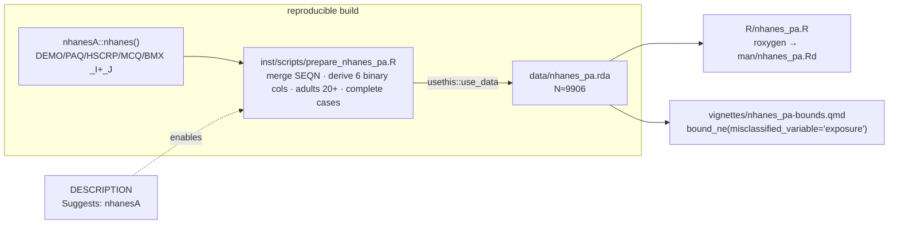

# SPEC — `nhanes_pa` exposure-side example dataset

| | |
|---|---|
| **Status** | archived — implemented & shipped in PR #13 (feature/nhanes-pa-example → dev) |
| **Created** | 2026-06-15 |
| **Archived** | 2026-06-15 |
| **Branch** | `feature/nhanes-pa-example` (worktree off `dev`) |
| **Closes** | GitHub issue #12 |
| **From** | `/workflow:brainstorm` (feature focus) → this spec |
| **Template** | existing `gesthtn` triad (`R/gesthtn.R`, `inst/scripts/prepare_gesthtn.R`, `vignettes/gesthtn-bounds.qmd`) |
| **Reference impl** | `~/projects/research/me-exposure-recall/code/{prepare_nhanes.R, analysis_nhanes.R}` (M2b, working + feasibility-checked) |

---

## Context

`medrobust` ships exactly one bundled worked example — `gesthtn` — which demonstrates a
differentially **misclassified mediator** (`M_star`). The **exposure** strand of the package
(`misclassified_variable = "exposure"`) has **no bundled example**, so the M2b exposure
recall-bias paper's vignette and `?bound_ne` examples cannot demonstrate the exposure path on
real data.

This spec adds `nhanes_pa`: a public-domain NHANES-derived dataset where the **exposure**
`A_star` (self-reported physical inactivity) is the differentially misclassified surrogate and
the mediator `M` (lab-measured hs-CRP) is **error-free** — the exact mirror image of `gesthtn`.
The M2b manuscript side already has a working, feasibility-checked reference implementation
(`prepare_nhanes.R` + `analysis_nhanes.R`); this is a **port into the package**, not a fresh
design.

**Intended outcome:** `data("nhanes_pa")`, `?nhanes_pa`, and
`vignette("nhanes_pa-bounds")` give a reproducible exposure-side counterpart to `gesthtn`,
completing the mediator/exposure symmetry of the package's worked examples.

---

## Overview

Pooled NHANES 2015–2016 (`_I`) + 2017–2018 (`_J`), adults 20+, complete cases. **Six binary
columns**, mirroring `gesthtn`'s schema but with the **exposure** misclassified:

| Col | Role | Meaning | NHANES derivation |
|-----|------|---------|-------------------|
| `A_star` | **misclassified exposure** | self-reported physical inactivity (recall/report-prone, no biomarker) | PAQ: leisure-time aerobic activity `< 150` equiv-moderate min/wk (vigorous counts ×2, 2018 PAG) |
| `M` | mediator, **measured without error** | elevated inflammation | HSCRP `LBXHSCRP` ≥ 3 mg/L |
| `Y` | outcome | prevalent CVD | MCQ `MCQ160C/D/E/F` (CHD/angina/MI/stroke), any = 1 |
| `C1` | confounder | age ≥ 50 | `RIDAGEYR >= 50` |
| `C2` | confounder | female | `RIAGENDR == 2` |
| `C3` | confounder | obese | `BMXBMI >= 30` |

**Expected N ≈ 9,906** (pooled, adults 20+, complete cases). The 8 `C1×C2×C3` strata are
well-populated (843–1,588 each), and `bound_ne(confounders = c("C1","C2","C3"))` is **feasible
across ψ_Sn ∈ {1, 1.5, 2, 3}**.

---

## Key decisions (resolved)

1. **Ship the FULL N≈9,906, no random sampling.** `gesthtn` draws a 5,000-row seeded sample
   from millions of births; `nhanes_pa` does **not** sample. Rationale: (a) strata feasibility
   is documented *at full N* — sampling could thin the 8 strata and break `bound_ne`
   feasibility; (b) the data is tiny (6 binary cols × ~10k rows → a few KB compressed);
   (c) full complete-cases is **deterministic** → no seed needed, reproducible by construction.
   → This supersedes issue #12's stale body text ("~5,000-row sample, seed 20260615, single
   confounder C1"); the finalized issue **comment** (full N, 3 confounders) is authoritative.

2. **Vignette runtime handled via quarto `freeze`, not by trimming the science.** The exposure
   path (`n_grid = 50`, `use_adaptive_grid = TRUE`, analytic CI, ψ loop) is heavier than
   gesthtn's single mediator call. `vignettes/_quarto.yml` already sets `freeze: auto`, so CRAN
   never re-runs it. Like gesthtn, this is a **vignette, not an Rd example** → no `>5s` Rd NOTE,
   `--as-cran` stays clean. The vignette may run a **reduced ψ set (e.g. {1, 1.5, 2})** for
   readability; the full {1,1.5,2,3} sweep stays in `inst/scripts`/the manuscript.

3. **Data-prep output uses `usethis::use_data()`.** M2b's `prepare_nhanes.R` writes a `.csv` to
   `../04_Data/`; the package script must instead build the frame and call
   `usethis::use_data(nhanes_pa, compress = "xz", overwrite = TRUE)` so it lands in `data/`.

4. **`nhanesA` → `Suggests`, not `Imports`.** It is a data-prep-only dependency (used solely by
   `inst/scripts/prepare_nhanes_pa.R`), never at runtime.

---

## Deliverables (acceptance criteria)

All five mirror the `gesthtn` triad. NEW code files → must live on this feature branch (blocked
on `dev`).

- [ ] **`DESCRIPTION`** — add `nhanesA` to `Suggests:` (alphabetical-ish, with the other
      data/dev suggests). *Accept:* `R CMD check` sees it; not in `Imports`.
- [ ] **`R/nhanes_pa.R`** — roxygen dataset doc cloned from `R/gesthtn.R`, adapted to the 6
      binary cols. Tags: `@description`, `@format` (6 `\item`s), `@details` (## Source data +
      ## Misclassification), `@source` (CDC NHANES public files + `nhanesA`), `@examples`,
      `@keywords datasets`; file ends with the bare string `"nhanes_pa"`. **Must document the
      cross-sectional differential-*reporting* caveat** (outcome-dependent Sn/Sp on a
      self-reported exposure — NOT case-control recall), as `gesthtn` documents its
      birth-certificate context. *Accept:* `devtools::document()` regenerates `man/nhanes_pa.Rd`;
      `@examples` run clean.
- [ ] **`inst/scripts/prepare_nhanes_pa.R`** — port `me-exposure-recall/code/prepare_nhanes.R`:
      `nhanesA::nhanes()` pulls for DEMO/PAQ/HSCRP/MCQ/BMX (`_I`+`_J`), `yn()`/`num()` sentinel
      helpers, `build_cycle()`, derivations exactly as the reference (A_star <150 equiv-min,
      M = hs-CRP≥3, Y = any MCQ160C/D/E/F, C1/C2/C3), `rbind` pool, adults 20+, complete cases.
      **Change the tail** to `usethis::use_data(nhanes_pa, compress = "xz", overwrite = TRUE)`
      run from repo root. *Accept:* running it produces `data/nhanes_pa.rda`.
- [ ] **`data/nhanes_pa.rda`** — generated by the script (requires `nhanesA` network pull).
      *Accept:* `data("nhanes_pa")` loads; `nrow ≈ 9906`; all 6 cols `{0,1}`; the 8 strata
      `table(C1,C2,C3)` each 843–1,588.
- [ ] **`vignettes/nhanes_pa-bounds.qmd`** — port `analysis_nhanes.R` into the
      `gesthtn-bounds.qmd` quarto skeleton (same YAML: `format: html`,
      `%\VignetteEngine{quarto::html}`, `%\VignetteIndexEntry{...}`). Chunks: setup/load → naive
      GLM (`A_star` as if true) → `sensitivity_region(sn0=c(.80,.95), sp0=c(.80,.95),
      psi_sn=c(1,ψ), psi_sp=c(1,1))` → `bound_ne(exposure="A_star", mediator="M", outcome="Y",
      confounders=c("C1","C2","C3"), misclassified_variable="exposure", ci_method="analytic",
      effect_scale="OR")`. **Feature the finding:** NDE excludes 1 at ψ_Sn ≤ 1.5, covers 1 at
      ψ_Sn ≥ 2; NIE small / not distinguishable from null. *Accept:* renders; reads as the
      exposure-side mirror of `gesthtn-bounds`.

### Polish / follow-up (not blocking the PR)

- [ ] `vignettes/_freeze/nhanes_pa-bounds/` entry — commit on the next **full** pkgdown/project
      render (a single-file `quarto render` won't write `_freeze`; same caveat as the gesthtn
      `.STATUS` note).
- [ ] `_pkgdown.yml` — register the vignette under articles + add `nhanes_pa` to the reference
      index (mirror the `gesthtn` entries).
- [ ] (optional) `tests/testthat/test-nhanes-pa.R` — feasibility smoke test: dataset loads,
      shape/strata assertions, `bound_ne(..., misclassified_variable="exposure")` returns a
      result whose bounds contain the naive estimate at ψ_Sn = 1.

---

## Architecture (how the pieces fit — mirrors `gesthtn`)



## API / data models

- **No package API changes.** No new exported functions; `bound_ne()` already supports
  `misclassified_variable = "exposure"` (the M2b reference exercises it directly).
- **Data model:** `nhanes_pa` — `data.frame`, ~9,906 × 6, every column `integer` ∈ {0,1}:
  `A_star, M, Y, C1, C2, C3`.

## Dependencies

- **New:** `nhanesA` (CRAN) → `Suggests` (data-prep only).
- **Existing reused:** `usethis::use_data` (build), `quarto` VignetteBuilder + `freeze: auto`
  (already configured in `vignettes/_quarto.yml`), `bound_ne` / `sensitivity_region` (runtime,
  unchanged).

## UI/UX specifications

N/A — package/CLI/data only; the "interface" is `?nhanes_pa` + the rendered vignette.

---

## Open questions

1. Vignette ψ set — render {1, 1.5, 2, 3} (full) or {1, 1.5, 2} (lighter)? *Lean: lighter for
   readability; full sweep in a fold or in `inst/scripts`.* Defer to render-time.
2. Ship the optional `test-nhanes-pa.R`? `gesthtn` has feasibility tests — adding a parallel one
   keeps coverage symmetric. *Lean: yes, minimal smoke test.*

## Implementation notes

- **Branch discipline:** all NEW files (R/, inst/scripts/, vignettes/, data/) are blocked on
  `dev` — they live on `feature/nhanes-pa-example`. Integrate via PR to `dev`.
- **Network:** generating `data/nhanes_pa.rda` requires the `nhanesA` pull (CDC servers). Run
  the prep script once; commit the resulting `.rda`.
- **Verbatim derivations:** lift `yn()`/`num()`/`build_cycle()` from the reference unchanged —
  the NHANES sentinel handling (7/9 → NA, 7777/9999… → NA) and the PAG `<150 equiv-min` rule are
  already validated on the manuscript side.
- **`git add` before render:** new vignette/data files must be tracked before any quarto build
  (worktree rule).

---

## Verification (end-to-end)

```r
# from the worktree repo root, on feature/nhanes-pa-example
devtools::document()                 # regenerates man/nhanes_pa.Rd + NAMESPACE
Rscript inst/scripts/prepare_nhanes_pa.R   # nhanesA pull → data/nhanes_pa.rda
devtools::load_all()
data("nhanes_pa")
stopifnot(nrow(nhanes_pa) > 9000, all(sapply(nhanes_pa, \(x) all(x %in% 0:1))))
print(table(nhanes_pa$C1, nhanes_pa$C2, nhanes_pa$C3))   # 8 strata, each ~843–1588

# exposure-path feasibility (the headline)
region <- sensitivity_region(sn0_range=c(.80,.95), sp0_range=c(.80,.95),
                             psi_sn_range=c(1,2), psi_sp_range=c(1,1))
b <- bound_ne(nhanes_pa, exposure="A_star", mediator="M", outcome="Y",
              confounders=c("C1","C2","C3"), misclassified_variable="exposure",
              sensitivity_region=region, effect_scale="OR", ci_method="analytic")
# expect: NDE interval informative at ψ_Sn≤1.5, covers 1 at ψ_Sn≥2; NIE ≈ null

devtools::test()                     # incl. optional test-nhanes-pa.R
quarto::quarto_render("vignettes/nhanes_pa-bounds.qmd")
devtools::check(args = "--as-cran")  # expect 0E / 0W / benign NOTEs only
```

---

## History

- **2026-06-15** — Initial draft from `/workflow:brainstorm` (feature focus). Decisions locked:
  full N (no sampling/seed), `usethis::use_data`, vignette via quarto `freeze`, `nhanesA` →
  Suggests. Worktree `feature/nhanes-pa-example` created off `dev`.
- **2026-06-15** — All deliverables implemented; opened PR #13. Post-review fixes: corrected
  NHANES day-count sentinels (`days()` helper; `.rda` byte-identical, N = 9906), renamed
  `get()` → `fetch_nhanes()`, dropped inert `ci_n_boot`, added a headline-finding regression
  test (NDE CI crosses the null between ψ_Sn = 1.5 and 2). Suite 20/20. **Archived** to
  `archive/` (moved out of the repo root prior to integration to `dev`).
