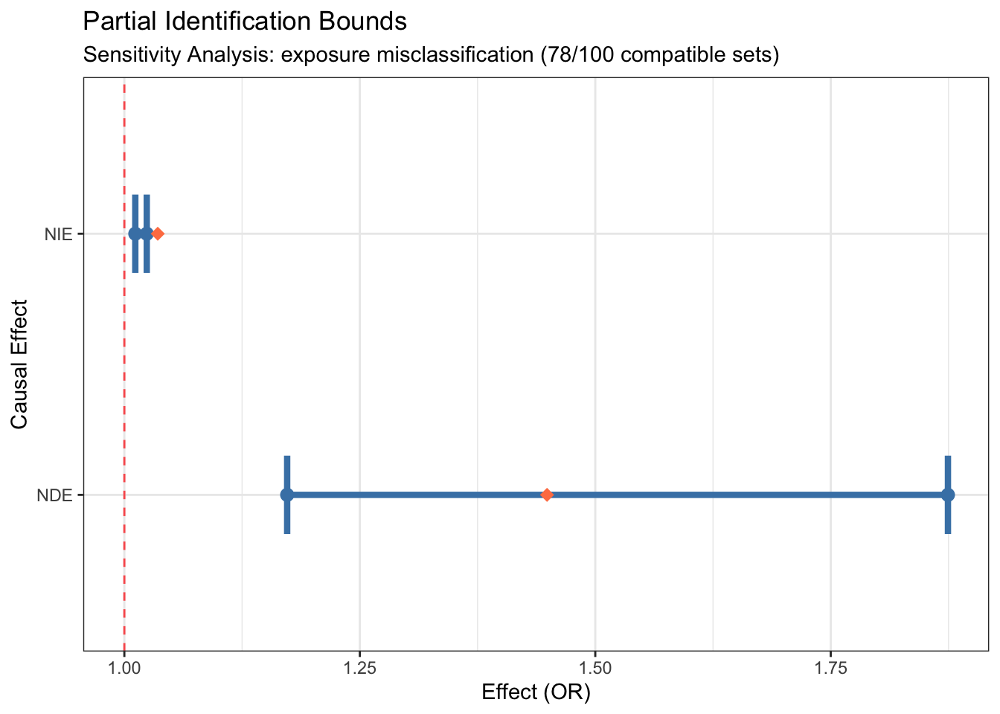
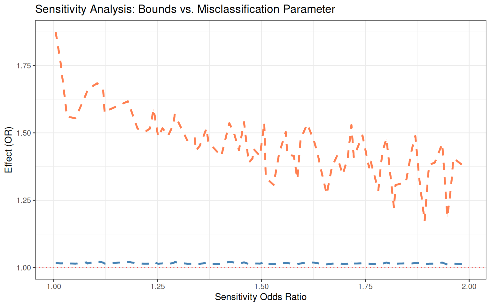
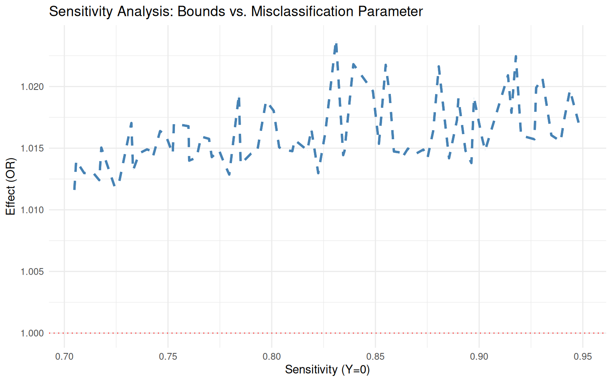
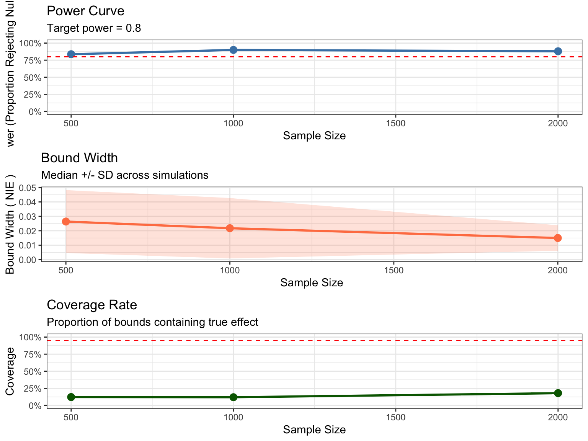
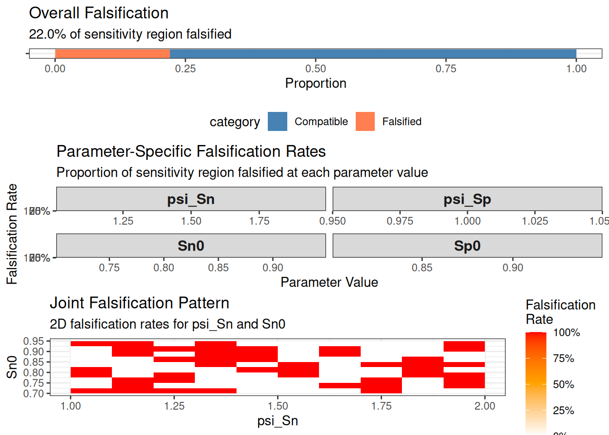

# Getting Started with medrobust

## Introduction

The `medrobust` package provides tools for conducting sensitivity
analysis for causal mediation effects when the exposure or mediator is
measured with **differential misclassification**. This is particularly
important when:

- The outcome may influence recall or reporting of the exposure/mediator
  (recall bias)
- Measurement error depends on other variables in the causal system
- Traditional measurement error correction methods requiring validation
  data are infeasible
- Gold-standard measurements are unavailable or too costly to obtain

### What is Differential Misclassification?

**Differential misclassification** occurs when the probability of
mismeasurement depends on other variables. For example:

- **Recall bias**: Participants with the outcome (e.g., disease) may
  remember exposures differently than those without
- **Outcome-dependent measurement error**: The outcome affects how the
  mediator or exposure is measured
- **Non-random measurement error**: Sensitivity and specificity vary
  across strata

This contrasts with **non-differential misclassification**, where
measurement error is independent of other variables.

### The Problem

Standard mediation analysis methods assume perfect measurement. When
differential misclassification is present:

- Point estimates of mediation effects are **biased**
- Confidence intervals have **incorrect coverage**
- Causal conclusions may be **invalid**

Traditional measurement error correction requires:

- Validation data with gold-standard measurements
- Strong parametric assumptions about error structure
- These are often unavailable in practice

### The Solution: Partial Identification

Instead of point estimation under strong assumptions, `medrobust` uses
**partial identification** to:

1.  Derive **bounds** on causal effects that remain valid under
    differential misclassification
2.  Test whether observed data are **compatible** with hypothesized
    misclassification parameters
3.  **Falsify** implausible parameter combinations using testable
    implications
4.  Provide **honest uncertainty quantification** via bootstrap
    confidence intervals

## Installation

``` r

# Install from GitHub
devtools::install_github("data-wise/medrobust")
```

``` r

library(medrobust)
library(parallel)
n_cores <- detectCores() - 2 # Leave two cores free
```

## Key Concepts

### Natural Direct and Indirect Effects

In causal mediation analysis, we decompose the total effect of exposure
$`A`$ on outcome $`Y`$ into:

- **Natural Direct Effect (NDE)**: Effect of $`A`$ on $`Y`$ not mediated
  through $`M`$
- **Natural Indirect Effect (NIE)**: Effect of $`A`$ on $`Y`$ mediated
  through $`M`$

On the odds ratio scale:

- $`\text{Total Effect} = \text{NDE} \times \text{NIE}`$

### Misclassification Parameters

The package uses four key parameters to characterize differential
misclassification:

**Baseline parameters** (when outcome $`Y = 0`$):

- `sn0`: Sensitivity (probability of correctly classifying a true
  positive)
- `sp0`: Specificity (probability of correctly classifying a true
  negative)

**Differential parameters** (how they change when $`Y = 1`$):

- `psi_sn`: Sensitivity odds ratio comparing $`Y=1`$ to $`Y=0`$
- `psi_sp`: Specificity odds ratio comparing $`Y=1`$ to $`Y=0`$

**Special cases:**

- **Non-differential misclassification**: `psi_sn = 1.0` and
  `psi_sp = 1.0`
- **Perfect measurement**: `sn0 = 1.0` and `sp0 = 1.0`

## Basic Workflow

The typical analysis follows these steps:

1.  **Simulate or load data**
2.  **Define sensitivity region** (plausible range of misclassification
    parameters)
3.  **Compute bounds** for NDE and NIE
4.  **Examine compatibility** with hypothesized parameters
5.  **Visualize results** using plot() and sensitivity_plot()
6.  **Perform inference** via bootstrap
7.  **Use generic methods** (summary, print, as.data.frame, as.list)
8.  **Power analysis** (optional: plan future studies)

## Example 1: Exposure Misclassification

Let’s analyze a scenario where the exposure is differentially
misclassified.

### Step 1: Generate Synthetic Data

``` r

# Set parameters for data generation
set.seed(123)

# True causal parameters
true_params <- list(
  beta_AM = log(1.5), # Effect of A on M (OR = 1.5)
  theta_AY = log(1.3), # Direct effect of A on Y (OR = 1.3)
  theta_MY = log(1.4), # Effect of M on Y (OR = 1.4)
  p_A = 0.4 # Marginal probability of A
)

# Misclassification parameters (differential)
dm_params <- list(
  sn0 = 0.85, # Sensitivity when Y=0
  sp0 = 0.90, # Specificity when Y=0
  psi_sn = 1.5, # Sensitivity increases when Y=1 (recall bias)
  psi_sp = 1.0 # Specificity unchanged
)

# Generate data with exposure misclassification
sim_data <- simulate_dm_data(
  n = 1000,
  true_params = true_params,
  dm_params = dm_params,
  misclass_type = "exposure",
  confounders = 2,
  seed = 123
)

# View structure
print(sim_data)
```


    ======================================================================
    SIMULATED DATA WITH DIFFERENTIAL MISCLASSIFICATION
    ======================================================================

    Sample size: n = 1000
    Misclassified variable: Exposure

    ----------------------------------------------------------------------
    MISCLASSIFICATION PARAMETERS
    ----------------------------------------------------------------------

    Specified:
      Sn0: 0.850
      Sp0: 0.900
      psi_Sn: 1.500
      psi_Sp: 1.000

    Empirical (from simulated data):
      Sn0: 0.835
      Sp0: 0.896
      Sn1: 0.876
      Sp1: 0.899
      Overall misclassification rate: 12.9%

    ----------------------------------------------------------------------
    TRUE CAUSAL EFFECTS
    ----------------------------------------------------------------------

    Odds Ratio Scale:
      NIE: 1.028
      NDE: 1.296
      TCE: 1.333
      PM: 0.110

    Risk Ratio Scale:
      NIE: 1.022
      NDE: 1.235
      TCE: 1.262

    Risk Difference Scale:
      NIE: 0.005
      NDE: 0.039
      TCE: 0.044

    ----------------------------------------------------------------------
    DATA PREVIEW
    ----------------------------------------------------------------------

    Observed data (first 6 rows):
      C1 C2 M Y A_star
    1  0  0 0 0      0
    2  1  1 1 1      0
    3  0  0 0 0      0
    4  1  1 1 1      1
    5  1  1 0 0      1
    6  0  0 0 0      1

    True data (first 6 rows):
      C1 C2 A M Y
    1  0  0 0 0 0
    2  1  1 1 1 1
    3  0  0 0 0 0
    4  1  1 1 1 1
    5  1  1 1 0 0
    6  0  0 1 0 0

    ======================================================================
    Use x@observed for analysis with bound_ne()
    Use x@true_effects to check if true effects are in bounds
    ====================================================================== 

``` r

# Check the class
cat("\nClass of sim_data:", class(sim_data), "\n")
```


    Class of sim_data: medrobust::simulated_dm_data S7_object 

The simulated data object is an S7 object that contains:

- `observed`: The data we actually observe (with misclassified exposure)
- `truth`: The true underlying data (for validation purposes)
- `true_effects`: The true causal effects we’re trying to estimate
- `generation_params`: Parameters used to generate the data

``` r

# Access the observed data using @ for S7 properties
head(sim_data@observed)
```

### Step 2: Define Sensitivity Region

We specify plausible ranges for the misclassification parameters:

``` r

# Define sensitivity region
sens_region <- sensitivity_region(
  sn0_range = c(0.70, 0.95), # Sensitivity ranges from 70% to 95%
  sp0_range = c(0.80, 0.95), # Specificity ranges from 80% to 95%
  psi_sn_range = c(1.0, 2.0), # Sensitivity OR from 1.0 to 2.0
  psi_sp_range = c(1.0, 1.0) # No differential specificity
)

print(sens_region)
```


    Sensitivity Region (Theta_psi):
    ----------------------------------------
      Sn0:  [0.700, 0.950]
      Sp0:  [0.800, 0.950]
      psi_Sn: [1.000, 2.000]
      psi_Sp: [1.000, 1.000]
    ---------------------------------------- 

Table 1: Defined sensitivity region for exposure misclassification

### Step 3: Compute Bounds

``` r

# Compute bounds over the sensitivity region
#
# PERFORMANCE NOTE:
# - n_grid = 10 creates 10^4 = 10,000 parameter combinations to evaluate
# - grid_method = "lhs" (Latin Hypercube Sampling) reduces evaluations significantly
# - For faster computation, enable parallel processing (see below)
# - For production analyses, use n_grid = 50 or higher for better resolution
#
# For CRAN vignette, we disable parallel processing
bounds <- bound_ne(
  data = sim_data@observed,
  exposure = "A_star", # Misclassified exposure
  mediator = "M",
  outcome = "Y",
  confounders = c("C1", "C2"),
  misclassified_variable = "exposure",
  sensitivity_region = sens_region,
  n_grid = 10, # Grid resolution (use 50+ for production)
  effect_scale = "OR",
  parallel = FALSE, # Set to TRUE with n_cores for faster processing in production
  verbose = FALSE,
  grid_method = "lhs" # (default) Latin Hypercube Sampling for efficiency
)

# View results
print(bounds)
```


    ======================================================================
    PARTIAL IDENTIFICATION BOUNDS
    ======================================================================

    Effect Scale: OR
    Misclassified Variable: exposure

    ----------------------------------------------------------------------
    NATURAL INDIRECT EFFECT (NIE)
    ----------------------------------------------------------------------
      Lower Bound: 1.0116
      Upper Bound: 1.0238
      Width:       0.0122

    ----------------------------------------------------------------------
    NATURAL DIRECT EFFECT (NDE)
    ----------------------------------------------------------------------
      Lower Bound: 1.1729
      Upper Bound: 1.8744
      Width:       0.7016

    ----------------------------------------------------------------------
    SENSITIVITY ANALYSIS
    ----------------------------------------------------------------------
      Parameter sets evaluated: 100
      Compatible sets:          78 (78.0%)
      Falsified sets:           22 (22.0%)

    ======================================================================
    Use summary() for detailed diagnostics
    ====================================================================== 

Table 2: Computed bounds on NIE and NDE under differential exposure
misclassification

The output shows:

- **Bounds on NIE and NDE**: The range of plausible causal effect
  estimates
- **Width of bounds**: How much uncertainty remains
- **Sensitivity analysis summary**: How many parameter sets are
  compatible vs. falsified

``` r

# Get more detailed summary
summary(bounds)
```


    ======================================================================
    PARTIAL IDENTIFICATION BOUNDS
    ======================================================================

    Effect Scale: OR
    Misclassified Variable: exposure

    ----------------------------------------------------------------------
    NATURAL INDIRECT EFFECT (NIE)
    ----------------------------------------------------------------------
      Lower Bound: 1.0116
      Upper Bound: 1.0238
      Width:       0.0122

    ----------------------------------------------------------------------
    NATURAL DIRECT EFFECT (NDE)
    ----------------------------------------------------------------------
      Lower Bound: 1.1729
      Upper Bound: 1.8744
      Width:       0.7016

    ----------------------------------------------------------------------
    SENSITIVITY ANALYSIS
    ----------------------------------------------------------------------
      Parameter sets evaluated: 100
      Compatible sets:          78 (78.0%)
      Falsified sets:           22 (22.0%)

    ======================================================================
    Use summary() for detailed diagnostics
    ======================================================================


    ======================================================================
    DETAILED SUMMARY
    ======================================================================

    Sensitivity Region:
      Sn0:     [0.700, 0.950]
      Sp0:     [0.800, 0.950]
      psi_Sn:    [1.000, 2.000]
      psi_Sp:    [1.000, 1.000]

    Naive Estimates (no measurement error correction):
    Data Summary:
      Sample size: 1000

    Compatible Parameter Sets (first 5):
            sn0       sp0   psi_sn psi_sp      NIE      NDE
    1 0.9028948 0.9064690 1.791070      1 1.014813 1.428186
    2 0.7598667 0.8393076 1.880388      1 1.016780 1.325090
    3 0.7427937 0.9405130 1.275196      1 1.014344 1.489662
    5 0.8350973 0.9280376 1.223051      1 1.014778 1.507371
    7 0.7522601 0.8600748 1.822771      1 1.014543 1.306651

Table 3: Detailed summary of bounds and falsification results

### Step 4: Visualize Results

``` r

# Use the plot() method to visualize bounds
plot(bounds)
```



Figure 1: Partial identification bounds for NIE and NDE

The plot() method creates a clear visualization showing the bounds for
NIE and NDE as error bars.

This plot shows:

- **Error bars**: The range of bounds for NIE and NDE
- **Points**: Lower and upper bounds for each effect
- **Dashed red line**: Null hypothesis value (OR = 1)
- **Subtitle**: Number of compatible vs. evaluated parameter sets

### Step 5: Test Specific Hypotheses

We can test whether specific misclassification parameters are compatible
with the data:

``` r

# Test specific misclassification parameters
# psi must contain all four parameters: sn0, sp0, psi_sn, psi_sp
compatibility <- check_compatibility(
  data = sim_data@observed,
  exposure = "A_star",
  mediator = "M",
  outcome = "Y",
  confounders = c("C1", "C2"),
  misclassified_variable = "exposure",
  psi = list(
    sn0 = 0.85, # Baseline sensitivity
    sp0 = 0.90, # Baseline specificity
    psi_sn = 1.5, # Differential sensitivity (OR)
    psi_sp = 1.0 # Non-differential specificity
  )
)

print(compatibility)
```


    ======================================================================
    COMPATIBILITY TEST
    ======================================================================

    Tested Parameters:
      Sn0: 0.850
      Sp0: 0.900
      psi_Sn: 1.500
      psi_Sp: 1.000
      -> Sn1: 0.895
      -> Sp1: 0.900

    ----------------------------------------------------------------------
    RESULT: Compatible [PASS]
    ----------------------------------------------------------------------

    The specified misclassification parameters are consistent with
    the observed data. All testable implications are satisfied.

    Constraints satisfied: 64 / 64

    Implied true causal parameters have been successfully solved.
    Use summary() to see detailed results.
    ====================================================================== 

Table 4: Compatibility test results for specified misclassification
parameters

### Step 6: Bootstrap Inference

For inference, we can compute bootstrap confidence intervals:

``` r

# This takes longer, so we use fewer bootstrap replications for the vignette
bounds_with_ci <- bound_ne(
  data = sim_data@observed,
  exposure = "A_star",
  mediator = "M",
  outcome = "Y",
  confounders = c("C1", "C2"),
  misclassified_variable = "exposure",
  sensitivity_region = sens_region,
  n_grid = 10,
  bootstrap = TRUE,
  bootstrap_reps = 100, # Use 1000+ for production
  parallel = FALSE, # Set to FALSE for CRAN vignette check
  confidence_level = 0.95,
  verbose = TRUE,
  grid_method = "lhs" # (default) Latin Hypercube Sampling for efficiency
)
```

    Validating inputs...
    Preparing data...

    Computing bounds for exposure misclassification...
    Grid resolution: 10 points per dimension
    Total parameter sets to evaluate: 10000

    Pre-computing observed probabilities...

    === Latin Hypercube Sampling ===
    Samples: 100

      |
      |                                                                      |   0%
      |
      |====                                                                  |   5%
      |
      |=======                                                               |  10%
      |
      |==========                                                            |  15%
      |
      |==============                                                        |  20%
      |
      |==================                                                    |  25%
      |
      |=====================                                                 |  30%
      |
      |========================                                              |  35%
      |
      |============================                                          |  40%
      |
      |================================                                      |  45%
      |
      |===================================                                   |  50%
      |
      |======================================                                |  55%
      |
      |==========================================                            |  60%
      |
      |==============================================                        |  65%
      |
      |=================================================                     |  70%
      |
      |====================================================                  |  75%
      |
      |========================================================              |  80%
      |
      |============================================================          |  85%
      |
      |===============================================================       |  90%
      |
      |==================================================================    |  95%
      |
      |======================================================================| 100%
    Compatible: 78/100 (78.0%)

    Computing bootstrap confidence intervals...

    Bootstrap Progress:

      |
      |                                                                      |   0%
      |
      |=                                                                     |   2%
      |
      |===                                                                   |   4%
      |
      |====                                                                  |   6%
      |
      |======                                                                |   8%
      |
      |=======                                                               |  10%
      |
      |========                                                              |  12%
      |
      |==========                                                            |  14%
      |
      |===========                                                           |  16%
      |
      |=============                                                         |  18%
      |
      |==============                                                        |  20%
      |
      |===============                                                       |  22%
      |
      |=================                                                     |  24%
      |
      |==================                                                    |  26%
      |
      |====================                                                  |  28%
      |
      |=====================                                                 |  30%
      |
      |======================                                                |  32%
      |
      |========================                                              |  34%
      |
      |=========================                                             |  36%
      |
      |===========================                                           |  38%
      |
      |============================                                          |  40%
      |
      |=============================                                         |  42%
      |
      |===============================                                       |  44%
      |
      |================================                                      |  46%
      |
      |==================================                                    |  48%
      |
      |===================================                                   |  50%
      |
      |====================================                                  |  52%
      |
      |======================================                                |  54%
      |
      |=======================================                               |  56%
      |
      |=========================================                             |  58%
      |
      |==========================================                            |  60%
      |
      |===========================================                           |  62%
      |
      |=============================================                         |  64%
      |
      |==============================================                        |  66%
      |
      |================================================                      |  68%
      |
      |=================================================                     |  70%
      |
      |==================================================                    |  72%
      |
      |====================================================                  |  74%
      |
      |=====================================================                 |  76%
      |
      |=======================================================               |  78%
      |
      |========================================================              |  80%
      |
      |=========================================================             |  82%
      |
      |===========================================================           |  84%
      |
      |============================================================          |  86%
      |
      |==============================================================        |  88%
      |
      |===============================================================       |  90%
      |
      |================================================================      |  92%
      |
      |==================================================================    |  94%
      |
      |===================================================================   |  96%
      |
      |===================================================================== |  98%
      |
      |======================================================================| 100%

     ------------------------------------------------------------
    Bootstrap Results (100 replicates, 100 successful, 0 failed)
    ------------------------------------------------------------

    NIE Lower Bound 95% CI: [1.014, 1.014]
    NIE Upper Bound 95% CI: [1.028, 1.028]

    NDE Lower Bound 95% CI: [1.149, 1.149]
    NDE Upper Bound 95% CI: [1.651, 1.651]
    ------------------------------------------------------------


     ============================================================
    COMPUTATION COMPLETE
    ============================================================
    Time elapsed: 63.23 seconds
    Compatible parameter sets: 78 / 100 (78.0%)

    NIE Bounds (OR scale): [1.012, 1.024]
    NDE Bounds (OR scale): [1.173, 1.874]
    ============================================================ 

``` r

print(bounds_with_ci)
```


    ======================================================================
    PARTIAL IDENTIFICATION BOUNDS
    ======================================================================

    Effect Scale: OR
    Misclassified Variable: exposure

    ----------------------------------------------------------------------
    NATURAL INDIRECT EFFECT (NIE)
    ----------------------------------------------------------------------
      Lower Bound: 1.0116
      Upper Bound: 1.0238
      Width:       0.0122

    ----------------------------------------------------------------------
    NATURAL DIRECT EFFECT (NDE)
    ----------------------------------------------------------------------
      Lower Bound: 1.1729
      Upper Bound: 1.8744
      Width:       0.7016

    ----------------------------------------------------------------------
    SENSITIVITY ANALYSIS
    ----------------------------------------------------------------------
      Parameter sets evaluated: 100
      Compatible sets:          78 (78.0%)
      Falsified sets:           22 (22.0%)

    ----------------------------------------------------------------------
    BOOTSTRAP CONFIDENCE INTERVALS
    ----------------------------------------------------------------------
      Method: percentile
      Replications: 100
      Confidence Level: 95.0%

      NIE Lower: [1.0138, 1.0138]
      NIE Upper: [1.0277, 1.0277]
      NDE Lower: [1.1494, 1.1494]
      NDE Upper: [1.6513, 1.6513]

    ======================================================================
    Use summary() for detailed diagnostics
    ====================================================================== 

### Step 7: Using Generic Methods

The package provides standard S7 generic methods for all result objects:

``` r

# Summary method provides detailed statistics
summary(bounds)
```


    ======================================================================
    PARTIAL IDENTIFICATION BOUNDS
    ======================================================================

    Effect Scale: OR
    Misclassified Variable: exposure

    ----------------------------------------------------------------------
    NATURAL INDIRECT EFFECT (NIE)
    ----------------------------------------------------------------------
      Lower Bound: 1.0116
      Upper Bound: 1.0238
      Width:       0.0122

    ----------------------------------------------------------------------
    NATURAL DIRECT EFFECT (NDE)
    ----------------------------------------------------------------------
      Lower Bound: 1.1729
      Upper Bound: 1.8744
      Width:       0.7016

    ----------------------------------------------------------------------
    SENSITIVITY ANALYSIS
    ----------------------------------------------------------------------
      Parameter sets evaluated: 100
      Compatible sets:          78 (78.0%)
      Falsified sets:           22 (22.0%)

    ======================================================================
    Use summary() for detailed diagnostics
    ======================================================================


    ======================================================================
    DETAILED SUMMARY
    ======================================================================

    Sensitivity Region:
      Sn0:     [0.700, 0.950]
      Sp0:     [0.800, 0.950]
      psi_Sn:    [1.000, 2.000]
      psi_Sp:    [1.000, 1.000]

    Naive Estimates (no measurement error correction):
    Data Summary:
      Sample size: 1000

    Compatible Parameter Sets (first 5):
            sn0       sp0   psi_sn psi_sp      NIE      NDE
    1 0.9028948 0.9064690 1.791070      1 1.014813 1.428186
    2 0.7598667 0.8393076 1.880388      1 1.016780 1.325090
    3 0.7427937 0.9405130 1.275196      1 1.014344 1.489662
    5 0.8350973 0.9280376 1.223051      1 1.014778 1.507371
    7 0.7522601 0.8600748 1.822771      1 1.014543 1.306651

``` r

# Convert to data frame for further analysis
bounds_df <- as.data.frame(bounds)
head(bounds_df)
```

``` r

# Convert to list for programmatic access
bounds_list <- as.list(bounds)
names(bounds_list)
```

     [1] "NIE_lower"              "NIE_upper"              "NDE_lower"
     [4] "NDE_upper"              "effect_scale"           "misclassified_variable"
     [7] "sensitivity_region"     "compatible_sets"        "n_compatible"
    [10] "n_evaluated"            "naive_estimates"       

``` r

# Plot method for visualization
plot(bounds)
```


### Step 8: Sensitivity Plots

Create customized sensitivity plots to visualize how bounds vary across
different misclassification parameters:

``` r

# Plot bounds as a function of sensitivity odds ratio
sensitivity_plot(
  bounds,
  param = "psi_sn",
  effect = "both",
  show_naive = TRUE,
  show_null = TRUE
)
```



Figure 2: Bounds vs. sensitivity parameter (psi_sn)

``` r

# Plot bounds as a function of baseline sensitivity
sensitivity_plot(bounds, param = "sn0", effect = "NIE", theme = "minimal")
```



Figure 3: Bounds vs. baseline sensitivity (sn0)

These plots show:

- **Ribbons**: Range of bounds across all compatible parameter sets for
  each parameter value
- **Dashed lines**: Upper and lower bounds
- **Horizontal lines**: Naive estimates (assuming no misclassification)
  and null values
- **How bounds vary**: As misclassification parameters change

## Power Analysis

Power analysis helps determine the sample size needed to detect
mediation effects despite measurement error.

### Planning a Study

``` r

# Conduct power analysis
power_result <- power_analysis(
  true_params = list(
    beta_AM = log(1.5), # A → M effect
    theta_AY = log(1.3), # A → Y direct effect
    theta_MY = log(1.4) # M → Y effect
  ),
  dm_params = list(
    sn0 = 0.85,
    sp0 = 0.90,
    psi_sn = 1.5,
    psi_sp = 1.0
  ),
  sensitivity_region = sens_region,
  misclass_type = "exposure",
  sample_sizes = c(500, 1000, 2000),
  n_sim = 50, # Use 500+ for production
  n_grid = 10,
  parallel = FALSE,
  verbose = FALSE
)

# View results
print(power_result)
```


    ======================================================================
    POWER ANALYSIS RESULTS
    ======================================================================

    Effect: NIE
    True effect value: 1.027
    Misclassified variable: Exposure

    ----------------------------------------------------------------------
    POWER CURVE
    ----------------------------------------------------------------------

        n     power coverage mean_width median_width    sd_width mean_lower
      500 0.8367347 0.122449 0.02874859   0.02641270 0.021811057   1.009165
     1000 0.9000000 0.120000 0.02649267   0.02176752 0.020962434   1.019624
     2000 0.8800000 0.180000 0.01637269   0.01498081 0.008830039   1.021415
     mean_upper
       1.037914
       1.046116
       1.037788

    ----------------------------------------------------------------------
    RECOMMENDATIONS
    ----------------------------------------------------------------------

    To achieve power >= 0.8 :
      Recommended sample size: n = 500

    ======================================================================
    Use plot() to visualize power and width curves
    ====================================================================== 

### Understanding Power Results

``` r

# Detailed summary
summary(power_result)
```


    ======================================================================
    POWER ANALYSIS RESULTS
    ======================================================================

    Effect: NIE
    True effect value: 1.027
    Misclassified variable: Exposure

    ----------------------------------------------------------------------
    POWER CURVE
    ----------------------------------------------------------------------

        n     power coverage mean_width median_width    sd_width mean_lower
      500 0.8367347 0.122449 0.02874859   0.02641270 0.021811057   1.009165
     1000 0.9000000 0.120000 0.02649267   0.02176752 0.020962434   1.019624
     2000 0.8800000 0.180000 0.01637269   0.01498081 0.008830039   1.021415
     mean_upper
       1.037914
       1.046116
       1.037788

    ----------------------------------------------------------------------
    RECOMMENDATIONS
    ----------------------------------------------------------------------

    To achieve power >= 0.8 :
      Recommended sample size: n = 500

    ======================================================================
    Use plot() to visualize power and width curves
    ======================================================================


    Detailed Power Curve Statistics:
    ----------------------------------------------------------------------

         n power_pct coverage_pct median_width mean_lower mean_upper
    1  500     83.7%        12.2%   0.02641270   1.009165   1.037914
    2 1000       90%          12%   0.02176752   1.019624   1.046116
    3 2000       88%          18%   0.01498081   1.021415   1.037788

``` r

# Convert to data frame for custom analysis
power_df <- as.data.frame(power_result)
print(power_df)
```

         n     power coverage mean_width median_width    sd_width mean_lower
    1  500 0.8367347 0.122449 0.02874859   0.02641270 0.021811057   1.009165
    2 1000 0.9000000 0.120000 0.02649267   0.02176752 0.020962434   1.019624
    3 2000 0.8800000 0.180000 0.01637269   0.01498081 0.008830039   1.021415
      mean_upper
    1   1.037914
    2   1.046116
    3   1.037788

### Visualizing Power Curves

``` r

# Plot power curves
plot(power_result)
```

    TableGrob (3 x 1) "arrange": 3 grobs
      z     cells    name           grob
    1 1 (1-1,1-1) arrange gtable[layout]
    2 2 (2-2,1-1) arrange gtable[layout]
    3 3 (3-3,1-1) arrange gtable[layout]



Figure 4: Statistical power as a function of sample size

The power plot shows:

- **Power curves**: Probability of detecting effects at different sample
  sizes
- **Target power line**: Common threshold at 0.80 (80% power)
- **Separate curves**: For NIE and NDE effects
- **Planning insight**: Sample size needed to achieve desired power

### Interpreting Power Analysis Results

The
[`power_analysis()`](https://data-wise.github.io/medrobust/reference/power_analysis.md)
function computes:

- **Power**: Probability that confidence intervals exclude the null
  value
- **Coverage**: Actual coverage probability of confidence intervals
- **Bias**: Average difference between estimates and true values
- **MSE**: Mean squared error of estimates

**Example interpretation:**

If power = 0.85 for NIE at n = 1000: - With 1000 participants, you have
85% probability of detecting the mediation effect - This assumes the
specified effect sizes and misclassification parameters - You can be
confident the study is adequately powered

## Example 2: Mediator Misclassification

Now let’s consider mediator misclassification instead:

``` r

# Generate data with mediator misclassification
sim_data_med <- simulate_dm_data(
  n = 1000,
  true_params = true_params,
  dm_params = dm_params,
  misclass_type = "mediator", # Mediator is misclassified
  confounders = 1,
  seed = 456
)

# Define sensitivity region for mediator misclassification
sens_region_med <- sensitivity_region(
  sn0_range = c(0.75, 0.90),
  sp0_range = c(0.75, 0.90),
  psi_sn_range = c(1.0, 1.5),
  psi_sp_range = c(1.0, 1.5)
)

# Compute bounds
bounds_med <- bound_ne(
  data = sim_data_med@observed,
  exposure = "A",
  mediator = "M_star", # Misclassified mediator
  outcome = "Y",
  confounders = "C1",
  misclassified_variable = "mediator",
  sensitivity_region = sens_region_med,
  n_grid = 10,
  verbose = FALSE,
  grid_method = "lhs" # (default) Latin Hypercube Sampling for efficiency
)

print(bounds_med)
```


    ======================================================================
    PARTIAL IDENTIFICATION BOUNDS
    ======================================================================

    Effect Scale: OR
    Misclassified Variable: mediator

    ----------------------------------------------------------------------
    NATURAL INDIRECT EFFECT (NIE)
    ----------------------------------------------------------------------
      Lower Bound: 1.0560
      Upper Bound: 1.1384
      Width:       0.0824

    ----------------------------------------------------------------------
    NATURAL DIRECT EFFECT (NDE)
    ----------------------------------------------------------------------
      Lower Bound: 1.4166
      Upper Bound: 1.5271
      Width:       0.1105

    ----------------------------------------------------------------------
    SENSITIVITY ANALYSIS
    ----------------------------------------------------------------------
      Parameter sets evaluated: 100
      Compatible sets:          67 (67.0%)
      Falsified sets:           33 (33.0%)

    ======================================================================
    Use summary() for detailed diagnostics
    ====================================================================== 

Table 5: Computed bounds on NIE and NDE under differential mediator
misclassification

## Example 3: Non-Differential Misclassification

As a special case, we can handle non-differential misclassification by
setting `psi_sn = 1.0` and `psi_sp = 1.0`:

``` r

# Non-differential misclassification: error doesn't depend on Y
sens_region_nondiff <- sensitivity_region(
  sn0_range = c(0.80, 0.90),
  sp0_range = c(0.80, 0.90),
  psi_sn_range = c(1.0, 1.0), # No differential sensitivity
  psi_sp_range = c(1.0, 1.0) # No differential specificity
)

bounds_nondiff <- bound_ne(
  data = sim_data@observed,
  exposure = "A_star",
  mediator = "M",
  outcome = "Y",
  confounders = c("C1", "C2"),
  misclassified_variable = "exposure",
  sensitivity_region = sens_region_nondiff,
  n_grid = 10,
  verbose = FALSE
)

print(bounds_nondiff)
```


    ======================================================================
    PARTIAL IDENTIFICATION BOUNDS
    ======================================================================

    Effect Scale: OR
    Misclassified Variable: exposure

    ----------------------------------------------------------------------
    NATURAL INDIRECT EFFECT (NIE)
    ----------------------------------------------------------------------
      Lower Bound: 1.0171
      Upper Bound: 1.0249
      Width:       0.0078

    ----------------------------------------------------------------------
    NATURAL DIRECT EFFECT (NDE)
    ----------------------------------------------------------------------
      Lower Bound: 1.6260
      Upper Bound: 1.7925
      Width:       0.1665

    ----------------------------------------------------------------------
    SENSITIVITY ANALYSIS
    ----------------------------------------------------------------------
      Parameter sets evaluated: 100
      Compatible sets:          67 (67.0%)
      Falsified sets:           33 (33.0%)

    ======================================================================
    Use summary() for detailed diagnostics
    ====================================================================== 

Table 6: Computed bounds on NIE and NDE under non-differential exposure
misclassification

Notice that bounds are typically **tighter** under non-differential
misclassification compared to differential misclassification, because
we’ve made a stronger assumption.

## Understanding the Output

### Bound Interpretation

The bounds tell us:

- **NIE bounds**: The range of plausible natural indirect effects
  (mediated effect)
- **NDE bounds**: The range of plausible natural direct effects
- **Width**: The amount of uncertainty remaining

**Example interpretation:**

If NIE is bounded in `[1.2, 1.8]` on the odds ratio scale:

- The true mediated effect is at least 20% increase in odds (OR ≥ 1.2)
- The true mediated effect is at most 80% increase in odds (OR ≤ 1.8)
- We cannot pin down the effect more precisely without stronger
  assumptions

### Compatibility Testing

The
[`check_compatibility()`](https://data-wise.github.io/medrobust/reference/check_compatibility.md)
function tests whether hypothesized misclassification parameters are
**consistent with the observed data** using testable implications.

**Compatible**: The parameters could have generated the observed data
**Falsified**: The parameters are inconsistent with the data (violated
testable constraints)

### Falsification Analysis

The sensitivity analysis automatically performs falsification:

- **Compatible sets**: Parameter combinations that satisfy all testable
  implications
- **Falsified proportion**: What fraction of the sensitivity region is
  ruled out

A high falsification rate (e.g., 95%) means the data strongly constrain
plausible scenarios.

## Advanced Features

### Extracting Results

You can extract various components from the results using built-in
methods:

``` r

# Convert to data frame for custom analysis
bounds_df <- as.data.frame(bounds)
print(bounds_df)

# Convert to list for programmatic access
bounds_list <- as.list(bounds)
names(bounds_list)

# Access compatible parameter sets directly
compatible_sets <- bounds@compatible_sets
print(head(compatible_sets))
```

### Comparing Different Scenarios

``` r

# Compare bounds under different sensitivity assumptions
comparison <- compare_bounds(
  bounds_list = list(
    "Differential" = bounds,
    "Non-differential" = bounds_nondiff
  )
)
print(comparison)
```

                             analysis NIE_lower NIE_upper NDE_lower NDE_upper
    Differential         Differential  1.011616  1.023788  1.172861  1.874433
    Non-differential Non-differential  1.017087  1.024852  1.625963  1.792505
                     falsified_prop
    Differential               0.22
    Non-differential           0.33

### Falsification Summary

``` r

# Get detailed falsification summary
falsif_summary <- falsification_summary(bounds)
print(falsif_summary)
```


    ======================================================================
    FALSIFICATION SUMMARY
    ======================================================================

    Overall Falsification:
      Total parameter sets evaluated: 100
      Compatible sets: 78 (78.0%)
      Falsified sets: 22 (22.0%)

      -> Low falsification: Weak data constraints
         Most of the sensitivity region remains compatible.

    ----------------------------------------------------------------------
    Parameter-Specific Falsification:
    ----------------------------------------------------------------------

     Parameter Mean_Falsification Min_Falsification Max_Falsification
           sn0              0.220             0.100             0.400
           sp0              0.220             0.000             1.000
        psi_sn              0.220             0.000             0.500
        psi_sp              0.900             0.000             1.000

    Most constrained parameters: psi_sp, sn0
    Least constrained parameters: psi_sn, sn0

    ====================================================================== 



Table 7: Falsification summary for the sensitivity analysis

## Practical Recommendations

### Choosing the Sensitivity Region

1.  **Literature review**: What misclassification rates have been
    reported in similar studies?
2.  **Pilot studies**: Can you conduct a small validation study?
3.  **Expert judgment**: Consult domain experts on plausible ranges
4.  **Conservative approach**: Use wide ranges initially, then refine
    based on falsification

### Grid Resolution

- Start with `n_grid = 10` for exploration
- Use `n_grid = 20-50` for publication
- Higher values increase computational time but improve precision

### Bootstrap Replications

- Use `n_bootstrap = 1000` or more for final results
- Percentile method is fast and simple
- BCa method provides better coverage but is slower

### Parallel Processing

For large datasets or fine grids, enable parallelization:

``` r

bounds_parallel <- bound_ne(
  data = sim_data@observed,
  exposure = "A_star",
  mediator = "M",
  outcome = "Y",
  confounders = c("C1", "C2"),
  misclassified_variable = "exposure",
  sensitivity_region = sens_region,
  n_grid = 50,
  parallel = TRUE,
  n_cores = 4
)
```

## Interpreting Results

### When Bounds are Tight

If bounds are narrow (e.g., NIE in \[1.3, 1.4\]):

- Strong evidence for mediation despite measurement error
- Conclusions are robust to misclassification assumptions
- Sensitivity region may be well-chosen

### When Bounds are Wide

If bounds are wide (e.g., NIE in \[0.8, 2.5\]):

- High uncertainty about mediation effects
- Need stronger assumptions or better measurements
- Consider collecting validation data

### When Most Parameters Are Falsified

If 90%+ of sensitivity region is falsified:

- Data strongly constrain plausible scenarios
- Observed patterns rule out many error mechanisms
- Tighter bounds may be achievable with refined sensitivity region

## Common Use Cases

### 1. Recall Bias in Epidemiology

When participants with disease may recall exposures differently:

``` r

# Disease may improve recall of past exposure
sens_region_recall <- sensitivity_region(
  sn0_range = c(0.60, 0.80), # Lower baseline sensitivity
  sp0_range = c(0.85, 0.95), # High specificity
  psi_sn_range = c(1.2, 2.5), # Cases recall better
  psi_sp_range = c(0.9, 1.1) # Specificity stable
)
```

### 2. Social Desirability Bias

When participants may underreport stigmatized behaviors:

``` r

# Underreporting of risk behaviors
sens_region_social <- sensitivity_region(
  sn0_range = c(0.50, 0.70), # Low sensitivity (underreporting)
  sp0_range = c(0.90, 0.98), # High specificity
  psi_sn_range = c(1.0, 1.0), # Non-differential
  psi_sp_range = c(1.0, 1.0)
)
```

### 3. Instrument Quality

When measurement instruments have known error rates:

``` r

# Based on validation study
sens_region_validated <- sensitivity_region(
  sn0_range = c(0.82, 0.88), # Narrow range from validation
  sp0_range = c(0.87, 0.93),
  psi_sn_range = c(1.0, 1.3), # Slight differential
  psi_sp_range = c(1.0, 1.0)
)
```

## Computational Performance

The
[`bound_ne()`](https://data-wise.github.io/medrobust/reference/bound_ne.md)
function evaluates many parameter combinations, which can be
time-consuming. Here are strategies to optimize performance:

### Grid Resolution Trade-offs

The `n_grid` parameter controls the number of points evaluated per
dimension:

``` r

# Quick exploration (625 combinations, ~10-30 seconds)
quick_bounds <- bound_ne(..., n_grid = 5)

# Standard analysis (10,000 combinations, 2-5 minutes)
standard_bounds <- bound_ne(..., n_grid = 10)

# High resolution (2.5 million combinations, 30-60 minutes)
detailed_bounds <- bound_ne(..., n_grid = 50)
```

**Recommendation**: Start with `n_grid = 5` for exploratory analysis,
then increase to `n_grid = 10-20` for final results.

### Parallel Processing

Enable parallel processing to dramatically reduce computation time:

``` r

# Detect available cores
library(parallel)
n_cores <- detectCores() - 2 # Leave two cores free

# Enable parallelization
bounds <- bound_ne(
  ...,
  parallel = TRUE,
  n_cores = n_cores # Use all available cores
)
```

**Performance gain**: With 8 cores, expect 5-7x speedup compared to
single-core execution.

### Grid Search Algorithms

The `grid_method` parameter controls which algorithm is used to search
the parameter space. The default is Latin Hypercube Sampling (LHS),
which provides dramatic speedups:

``` r

# Latin Hypercube Sampling (default) - 99% fewer evaluations
bounds_lhs <- bound_ne(
  ...,
  n_grid = 10,
  grid_method = "lhs" # Default - fastest for most cases
)

# Regular exhaustive grid - exact but slow
bounds_regular <- bound_ne(
  ...,
  n_grid = 10,
  grid_method = "regular" # 10^4 = 10,000 evaluations
)

# Auto-select best method based on data characteristics
bounds_auto <- bound_ne(
  ...,
  n_grid = 10,
  grid_method = "auto" # Probes parameter space first
)
```

**Available methods**:

- `"lhs"` (default): Latin Hypercube Sampling - space-filling design
  that reduces evaluations by 99% while maintaining broad coverage
  (McKay et al., 1979)
- `"auto"`: Automatically selects best method based on problem
  characteristics
- `"regular"`: Exhaustive grid search (use for exact bounds when time
  permits)
- `"sobol"`: Sobol low-discrepancy sequences (Sobol, 1967) - similar to
  LHS
- `"adaptive"`: Two-stage coarse-to-fine refinement
- `"binary"`: Binary search on parameter boundaries (efficient when
  bounds are monotonic)

**Performance comparison** (n_grid = 10):

| Method  | Evaluations | Time      | Speedup |
|---------|-------------|-----------|---------|
| Regular | 10,000      | 45 sec    | 1x      |
| LHS     | 100         | 0.7 sec   | 67x     |
| Sobol   | 100         | 0.7 sec   | 64x     |
| Auto    | 100-500     | 0.4-2 sec | 25-100x |

**Recommendation**: Use the default `"lhs"` for most analyses. Use
`"regular"` only when exact bounds are required and computational budget
allows.

### Caching Results

For repeated analyses with the same data:

``` r

# Enable caching to reuse intermediate results
bounds <- bound_ne(
  ...,
  cache = TRUE,
  cache_dir = "cache/" # Optional: specify cache location
)
```

### Computational Complexity

Computation time scales as:

- **Grid size**: O(n_grid^4) - exponential in grid resolution
- **Sample size**: O(n) - linear in data size
- **Bootstrap**: O(bootstrap_reps) - linear in number of replicates

**Example timings** (approximate, on modern laptop): - n_grid = 5, no
bootstrap: 10-30 seconds - n_grid = 10, no bootstrap: 2-5 minutes -
n_grid = 10, parallel (4 cores): 30-60 seconds - n_grid = 50, parallel
(8 cores): 10-20 minutes

## Limitations and Assumptions

The methods assume:

1.  **No unmeasured confounding** of A-M, M-Y, and A-Y relationships
2.  **Binary variables**: A, M, and Y are all binary
3.  **Conditional exchangeability**: Standard causal identification
    assumptions hold
4.  **Monotonicity**: Misclassification probabilities follow specified
    parametric form

The bounds are:

- **Partial identification**: Not point identification (intervals, not
  points)
- **Sensitive to sensitivity region**: Wide regions → wide bounds
- **Computationally intensive**: Grid search over parameter space

## Next Steps

After completing this introduction:

1.  **Explore your own data**: Apply the methods to your research
    questions
2.  **Read the methodology vignette**: Understand the theoretical
    foundations
3.  **Check advanced examples**: See complex scenarios and diagnostics
4.  **Consult the reference manual**: Detailed documentation of all
    functions

## Getting Help

- **Package documentation**:
  [`?bound_ne`](https://data-wise.github.io/medrobust/reference/bound_ne.md),
  [`?simulate_dm_data`](https://data-wise.github.io/medrobust/reference/simulate_dm_data.md),
  etc.
- **GitHub issues**: Report bugs at
  <https://github.com/data-wise/medrobust/issues>
- **Vignettes**: Browse other vignettes for specific topics

## References

Tofighi, D. (2025). Partial identification bounds for causal mediation
effects under differential misclassification. *Manuscript in
preparation*.

VanderWeele, T. J. (2015). *Explanation in Causal Inference: Methods for
Mediation and Interaction*. Oxford University Press.

McKay, M. D., Beckman, R. J., & Conover, W. J. (1979). A comparison of
three methods for selecting values of input variables in the analysis of
output from a computer code. *Technometrics*, 21(2), 239-245.

Sobol’, I. M. (1967). On the distribution of points in a cube and the
approximate evaluation of integrals. *USSR Computational Mathematics and
Mathematical Physics*, 7(4), 86-112.

## Session Information

``` r

sessionInfo()
```

    R version 4.6.0 (2026-04-24)
    Platform: x86_64-pc-linux-gnu
    Running under: Ubuntu 24.04.4 LTS

    Matrix products: default
    BLAS:   /usr/lib/x86_64-linux-gnu/openblas-pthread/libblas.so.3
    LAPACK: /usr/lib/x86_64-linux-gnu/openblas-pthread/libopenblasp-r0.3.26.so;  LAPACK version 3.12.0

    locale:
     [1] LC_CTYPE=C.UTF-8       LC_NUMERIC=C           LC_TIME=C.UTF-8
     [4] LC_COLLATE=C.UTF-8     LC_MONETARY=C.UTF-8    LC_MESSAGES=C.UTF-8
     [7] LC_PAPER=C.UTF-8       LC_NAME=C              LC_ADDRESS=C
    [10] LC_TELEPHONE=C         LC_MEASUREMENT=C.UTF-8 LC_IDENTIFICATION=C

    time zone: UTC
    tzcode source: system (glibc)

    attached base packages:
    [1] parallel  stats     graphics  grDevices utils     datasets  methods
    [8] base

    other attached packages:
    [1] medrobust_0.4.0

    loaded via a namespace (and not attached):
     [1] vctrs_0.7.3        cli_3.6.6          knitr_1.51         rlang_1.2.0
     [5] xfun_0.59          otel_0.2.0         generics_0.1.4     S7_0.2.2
     [9] jsonlite_2.0.0     labeling_0.4.3     glue_1.8.1         htmltools_0.5.9
    [13] gridExtra_2.3      scales_1.4.0       rmarkdown_2.31     grid_4.6.0
    [17] evaluate_1.0.5     tibble_3.3.1       fastmap_1.2.0      yaml_2.3.12
    [21] lifecycle_1.0.5    compiler_4.6.0     dplyr_1.2.1        RColorBrewer_1.1-3
    [25] pkgconfig_2.0.3    farver_2.1.2       digest_0.6.39      R6_2.6.1
    [29] tidyselect_1.2.1   pillar_1.11.1      magrittr_2.0.5     withr_3.0.3
    [33] tools_4.6.0        gtable_0.3.6       ggplot2_4.0.3     
